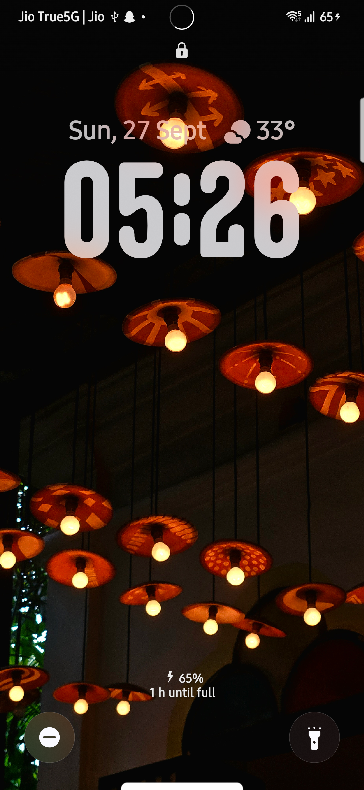
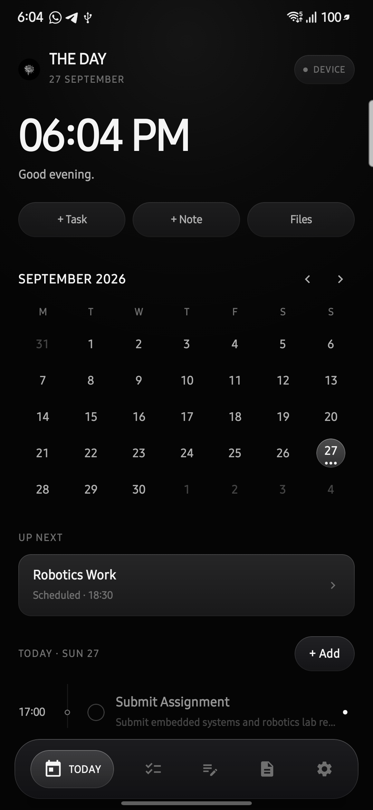
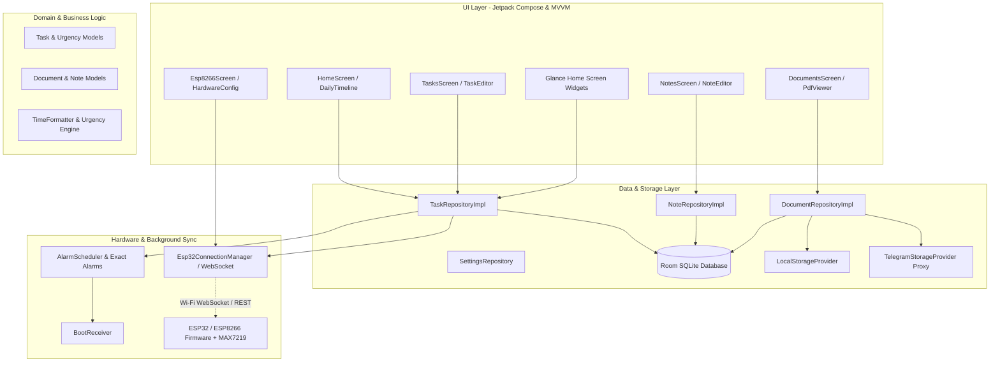

# DAY — Distraction-Free Daily Planner & Hardware-Connected Workspace

<div align="center">

[-3DDC84?style=for-the-badge&logo=android&logoColor=white)](https://developer.android.com/)
[](https://kotlinlang.org/)
[](https://developer.android.com/jetpack/compose)
[](https://developer.android.com/training/data-storage/room)
[](https://www.espressif.com/)
[](LICENSE)

**A high-performance, distraction-free productivity app built with modern Jetpack Compose, an offline-first Room database, a bold Neo-Brutalist design language, and realtime physical desk display synchronization via ESP32 / ESP8266 microcontrollers.**

[Overview](#-overview) • [Key Features](#-key-features) • [Screenshots](#-screenshots--ui-gallery) • [Architecture](#-project-architecture) • [Tech Stack](#-technology-stack) • [Getting Started](#-installation--setup) • [Hardware Sync](#-hardware-firmware-setup) • [License](#-license)

</div>

---

## ⚡ Overview

Modern productivity tools are often cluttered, slow, and full of friction. **DAY** is built around a single unifying principle: **give you absolute clarity over your current day while keeping your physical workspace in sync.**

Combining a distinct **Neo-Brutalist UI** (high-contrast borders, tactile feedback, bold typography, and smooth micro-animations) with physical hardware integration, **DAY** bridges your digital schedule directly to your desk. Whether working directly on your Android device or glancing at a dedicated 8x8 LED matrix driven by an ESP32/ESP8266, your active task and urgency are always in view.

### Who is it for?
- **Developers and makers** who appreciate tactile, high-contrast, distraction-free software.
- **Deep-work practitioners** who want a physical desk display to maintain focus without picking up their phone.
- **Privacy-conscious users** who demand an offline-first architecture with optional secure cloud vaulting.

---

## 🌟 Key Features

### 📅 24-Hour Visual Daily Timeline & Planner
- **Interactive Daily Schedule**: Real-time visual timeline showing completed, active, and upcoming time blocks.
- **Milestone Navigation**: Jump between days with an integrated weekly strip and month calendar picker.
- **Dynamic Urgency Tracking**: Automatically computes task urgency (`NORMAL`, `APPROACHING`, `DUE NOW`, `OVERDUE`, `IGNORED`).

### 📟 Physical Desk Display Sync (ESP32 & ESP8266)
- **Realtime WebSocket / HTTP Protocol**: Connects wirelessly over local Wi-Fi to ESP32 or ESP8266 microcontrollers.
- **MAX7219 8x8 Matrix Rendering**:
  - Compact **3x4 digital clock bitmap font** for ambient timekeeping.
  - Live task marquee scrolling with active urgency pulses and flash alerts.
  - Test pattern mode and brightness controls adjustable directly from the mobile app.
- **Zero-Latency State Updates**: Instantly reflects task completion or status transitions across hardware and phone.

### 🎨 Neo-Brutalist Design System
- **Bold Visual Identity**: Sharp borders, solid offset drop-shadows, curated vibrant accents, and high-legibility typography.
- **Glassmorphic Navigation**: Translucent bottom navigation bar with fluid screen transitions.
- **Haptic & Visual Feedback**: Tactile button responses, swipe-to-complete actions, and interactive progress bars.

### 🔔 Smart Alarms & Background Scheduling
- **Exact Alarms (`AlarmManager`)**: Precision wakeups for scheduled task milestones.
- **Actionable Notifications**: Mark tasks as done or snooze directly from the notification shade without launching the app.
- **Reboot Resilience (`BootReceiver`)**: Automatically recalculates and reschedules all pending alarms upon device reboot.

### 📂 Document & Note Vault with Native PDF Viewer
- **Categorized Document Archive**: Store receipts, invoices, IDs, and notes with custom tags and search.
- **Embedded PDF Rendering**: Fast hardware-accelerated PDF page rendering using Android's native `PdfRenderer`.
- **Hybrid Storage Engine**: Local private storage cache with optional cloud backup relay via Telegram Bot API proxy.

### 📱 Android Home Screen Glance Widgets
- **Interactive AppWidgets**: Jetpack Glance-powered home screen widgets (Compact and Large layouts).
- **Live Sync**: Instantly reflects task updates, priority badges, and daily countdowns without opening the app.

---

## 📸 Screenshots & UI Gallery

<div align="center">
  <table>
    <tr>
      <td align="center" width="50%">
        
        <br /><b>Daily Timeline & Live Overview</b>
      </td>
      <td align="center" width="50%">
        
        <br /><b>Interactive Task Management</b>
      </td>
    </tr>
    <tr>
      <td align="center" width="50%">
        
        <br /><b>Visual 24-Hour Day Planner</b>
      </td>
      <td align="center" width="50%">
        
        <br /><b>Neo-Brutalist Component System</b>
      </td>
    </tr>
  </table>
</div>

---

## 🛠 Technology Stack

### Android Application
| Layer | Technology |
|---|---|
| **Language** | Kotlin 1.9.23 |
| **Minimum SDK** | Android 8.0 (API Level 26) |
| **Target / Compile SDK** | Android 14 (API Level 34) |
| **UI Framework** | Jetpack Compose (BOM `2024.04.01`), Material 3, Custom Neo-Brutalist Design System |
| **Architecture** | MVVM + Repository Pattern + Clean Architecture |
| **Local Database** | Room 2.6.1 with KSP (Kotlin Symbol Processing) |
| **Asynchronous & Concurrency** | Kotlin Coroutines & `StateFlow` / `SharedFlow` |
| **Home Screen Widgets** | Jetpack Glance AppWidget `1.0.0` |
| **Networking & HTTP** | OkHttp 4.12.0, Gson 2.10.1, Java-WebSocket |
| **Document Rendering** | Android Native `PdfRenderer` |
| **Build System** | Gradle 8.7 (Kotlin DSL), Android Gradle Plugin 8.3.2 |

### Embedded Firmware (Hardware Display)
| Component | Technology |
|---|---|
| **Microcontrollers** | ESP32 Dev Module / ESP8266 NodeMCU 1.0 (ESP-12E) |
| **Display Driver** | MAX7219 8x8 / FC-16 LED Matrix via `MD_MAX72xx` |
| **Networking** | `ESPAsyncWebServer`, `AsyncTCP`, `WebSocketsServer` |
| **Serialization** | `ArduinoJson` (v6/v7) |
| **Clock Synchronization** | NTP Client (`pool.ntp.org`) |

---

## 🏗 Project Architecture



---

## 📁 Repository Structure

```text
DAY/
├── app/                                # Android Application Module
│   ├── build.gradle.kts                # App-level build configuration and dependencies
│   └── src/
│       ├── main/
│       │   ├── AndroidManifest.xml     # App permissions, activities, receivers, services
│       │   ├── java/com/day/app/
│       │   │   ├── DayApplication.kt   # Application lifecycle & dependency container
│       │   │   ├── MainActivity.kt     # Single activity entry point with edge-to-edge UI
│       │   │   ├── alarms/             # AlarmScheduler, AlarmReceiver, BootReceiver
│       │   │   ├── data/
│       │   │   │   ├── local/          # Room DB, DAOs, Entities, Type Converters
│       │   │   │   ├── repository/     # Task, Document, Note, Settings repositories
│       │   │   │   └── storage/        # Local and Telegram file storage providers
│       │   │   ├── domain/model/       # Core domain models (Task, Note, Document, Priority)
│       │   │   ├── esp8266/            # WebSocket client, REST service, protocol models
│       │   │   ├── navigation/         # Compose Navigation host and destination routes
│       │   │   ├── notifications/      # Channels, notification builders, action receivers
│       │   │   ├── ui/
│       │   │   │   ├── components/     # Neo-Brutalist design system components
│       │   │   │   ├── details/        # Task detailed inspection screens
│       │   │   │   ├── documents/      # Document vault & native PDF viewer
│       │   │   │   ├── esp8266/        # Hardware status and matrix control screen
│       │   │   │   ├── home/           # 24-hour timeline, day blocks, calendar
│       │   │   │   ├── notes/          # Note editor and organization views
│       │   │   │   ├── settings/       # App preferences and backup configuration
│       │   │   │   ├── taskeditor/     # Task creation & editing modal screens
│       │   │   │   ├── tasks/          # Filterable task manager view
│       │   │   │   └── theme/          # Neo-Brutalist color tokens, shapes, typography
│       │   │   ├── util/               # Time formatters and helpers
│       │   │   └── widget/             # AndroidX Glance AppWidgets
│       │   └── res/                    # Drawables, XML layouts, strings, widget previews
│       └── test/java/com/day/app/      # Unit tests (Domain, Notifications, TimeFormatter)
├── docs/
│   └── screenshots/                    # High-resolution screenshots and UI previews
├── esp32_firmware/                     # ESP32 WebSocket & MAX7219 Firmware
│   ├── esp32_the_day.ino               # Arduino C++ source for ESP32 Dev Module
│   └── README.md                       # Pinout and flashing instructions
├── esp8266_firmware/                   # ESP8266 REST / WebSocket Firmware
│   └── esp8266_firmware.ino            # Arduino C++ source for ESP8266 NodeMCU
├── gradle/wrapper/                     # Gradle wrapper binary and configuration
├── .gitignore                          # Git ignore specification
├── build.gradle.kts                    # Root build configuration
├── settings.gradle.kts                 # Project repository and module definitions
├── LICENSE                             # MIT License
├── preview.bat                         # Quick-launch live preview batch script
└── preview.ps1                         # PowerShell live preview & ADB automation script
```

---

## 🚀 Installation & Setup

### Prerequisites
- **JDK**: Java Development Kit 17+
- **Android SDK**: API Level 34 (Android 14)
- **Android Studio**: Android Studio Iguana / Jellyfish (or later) recommended
- **Arduino IDE / PlatformIO**: (Optional, for building ESP firmware)

### 1. Clone the Repository
```bash
git clone https://github.com/Ankit2429/Day.git
cd Day
```

### 2. Configure Local Android SDK
Ensure `local.properties` exists in the project root with the path to your Android SDK:
```properties
sdk.dir=/path/to/your/android/sdk
```
*(On Windows: `sdk.dir=C\:\\Users\\<Username>\\AppData\\Local\\Android\\Sdk`)*

### 3. Build & Run Tests
Verify the build and run the unit test suite:
```bash
# On Linux / macOS
./gradlew testDebugUnitTest

# On Windows PowerShell
.\gradlew testDebugUnitTest
```

### 4. Install & Launch on Device / Emulator
```bash
# Build and install Debug APK
.\gradlew installDebug

# Or launch directly via ADB
adb shell am start -n com.day.app/.MainActivity
```

---

## 🔌 Hardware Firmware Setup

Connect an external **MAX7219 8x8 Matrix Display** to an **ESP32** or **ESP8266** to enable the secondary desk display.

### Hardware Wiring (ESP32 Dev Module)

| MAX7219 Pin | ESP32 Pin | Function |
|---|---|---|
| **VCC** | **VIN / 5V** | 5V Power Supply |
| **GND** | **GND** | Ground |
| **DIN** | **GPIO 23** | VSPI MOSI (Data In) |
| **CS** | **GPIO 5** | VSPI SS (Chip Select) |
| **CLK** | **GPIO 18** | VSPI SCK (Clock) |

### Flashing the Microcontroller
1. Open `esp32_firmware/esp32_the_day.ino` (or `esp8266_firmware/esp8266_firmware.ino`) in **Arduino IDE**.
2. Install required Arduino libraries via Library Manager:
   - `ArduinoJson` (v6.x or v7.x)
   - `MD_MAX72XX` (by MajicDesigns)
   - `ESPAsyncWebServer` & `AsyncTCP` (for ESP32) or `WebSockets` (for ESP8266)
3. Set your Wi-Fi credentials in the firmware:
   ```cpp
   const char* WIFI_SSID = "Your_WiFi_Network";
   const char* WIFI_PASS = "Your_WiFi_Password";
   ```
4. Flash the sketch to your board and open the Serial Monitor (115200 baud) to note the assigned IP address (e.g. `192.168.1.105`).
5. In **DAY**, open the **ESP32** settings, enter the device IP, and tap **Connect**.

---

## ⚙️ Configuration & Storage

| Configuration | Description | Default |
|---|---|---|
| **ESP Device IP** | Local IP address of your ESP32/ESP8266 module | Configured in App UI |
| **Auto-Sync Display** | Automatically connects and syncs matrix display on startup | `true` |
| **Telegram Cloud Proxy** | Optional server endpoint URL for Telegram bot storage relay | `DEFAULT` (Local offline storage) |

---

## 🧪 Testing & Quality Assurance

The project includes unit tests for core domain logic, time calculation engines, and notification triggers:
```bash
# Run all unit test suites
.\gradlew testDebugUnitTest --info
```

All 26 compilation and verification tasks execute with 100% test pass rate.

---

## 🤝 Contributing

Contributions, bug reports, and feature suggestions are welcome!

1. Fork the repository (`https://github.com/Ankit2429/Day.git`).
2. Create your feature branch (`git checkout -b feature/AmazingFeature`).
3. Commit your changes with clear messages (`git commit -m 'feat: add amazing feature'`).
4. Push to the branch (`git push origin feature/AmazingFeature`).
5. Open a Pull Request.

---

## 📄 License

This project is licensed under the **MIT License** — see the [LICENSE](LICENSE) file for details.

---

## 👤 Author

**Ankit**
- GitHub: [@Ankit2429](https://github.com/Ankit2429)
- Repository: [https://github.com/Ankit2429/Day](https://github.com/Ankit2429/Day)
